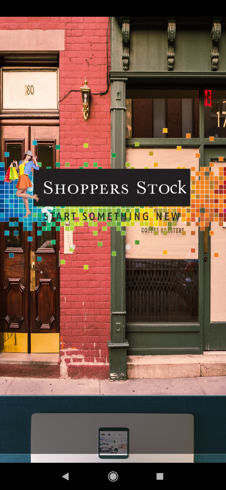
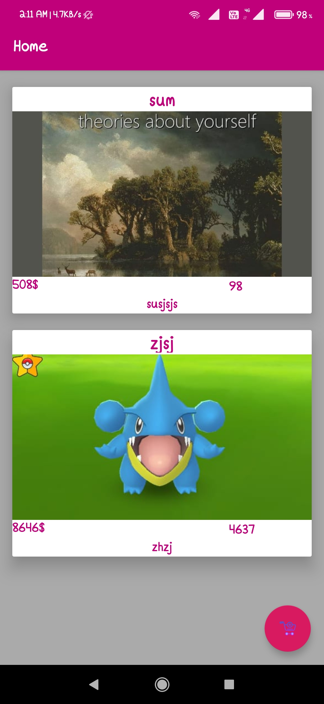
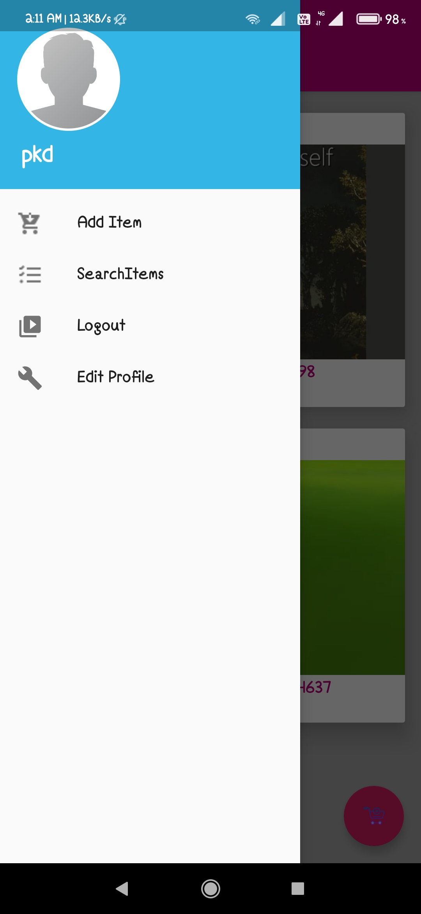
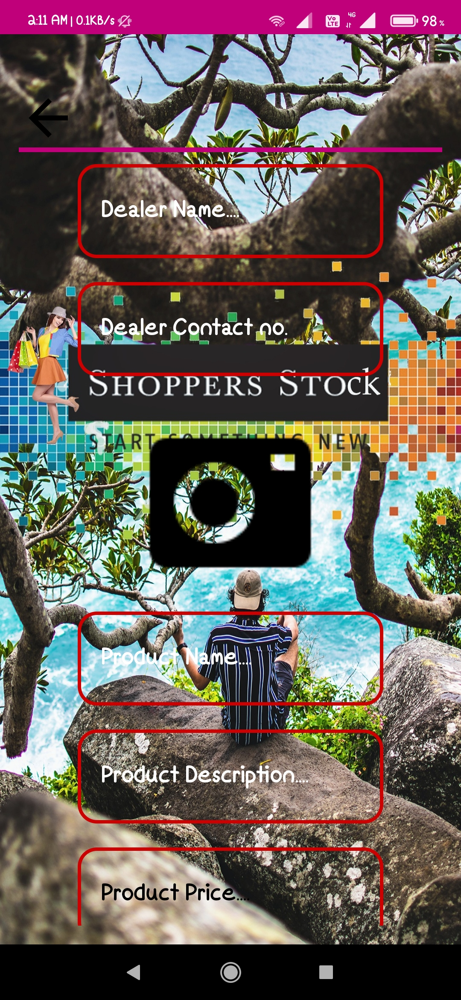
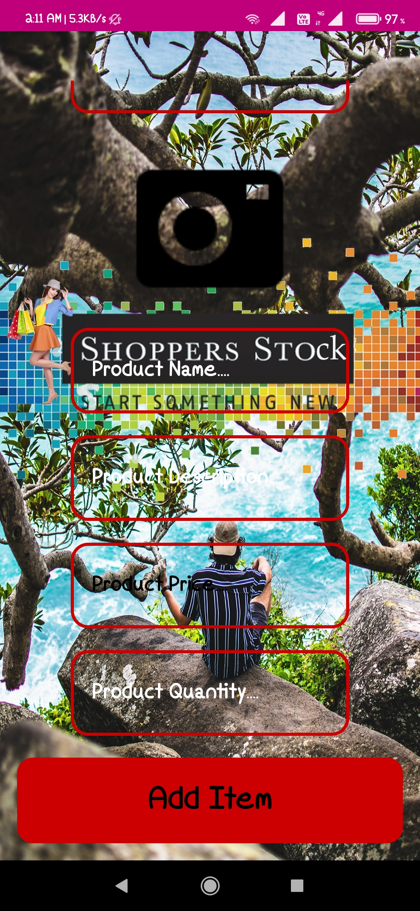
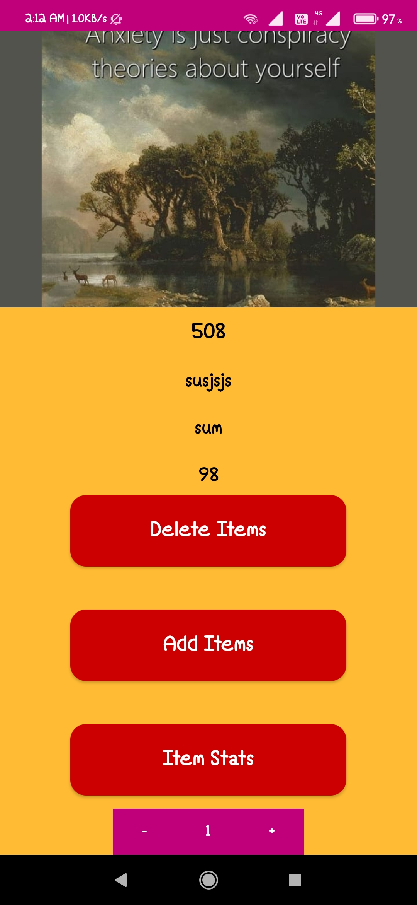

# Droid_project
This is a beginner level android project.

## How to run the project ? 
Firstly you need to fork(using the fork button in the right up corner) this project and then clone it on your local machine and then open your Android Studio and then open the ***express directory*** in your Android Studio and then start building this project(it will take time depending on your net connection speed).
- **Note**: For cloning you can use a terminal if you are on linux and terminal on windows just type 
```
git clone https://github.com/YourGitUserID/Droid_project/
```
Alternative of cloning you can simply download the repo in zip format.

## Contribution guidelines:
For this you can read [this](https://github.com/Wishy-S/Droid_project/blob/exp/CONTRIBUTING.md)

### Below are some screenshots of the app :



<!--[](Screenshot_2020-10-16-02-08-34-693_com.example.express.jpg)<!--.element height="10%" width="10%"-->
<HR></HR>


<HR></HR>

<!--[](Screenshot_2020-10-16-02-08-38-507_com.example.express.jpg)<!--.element height="10%" width="10%"-->

<HR></HR>

<!--[](Screenshot_2020-10-16-02-11-19-057_com.example.express.jpg)<!--.element height="10%" width="10%"-->

<HR></HR>

<!--[](Screenshot_2020-10-16-02-11-24-229_com.example.express.jpg)<!--.element height="10%" width="10%"-->

<HR></HR>

<!--[](Screenshot_2020-10-16-02-11-30-616_com.example.express.jpg)<!--.element height="10%" width="10%"-->

<HR></HR>

<!--[](Screenshot_2020-10-16-02-11-41-196_com.example.express.jpg)<!--.element height="10%" width="10%"-->

<HR></HR>

<!--[](Screenshot_2020-10-16-02-12-04-884_com.example.express.jpg)<!--.element height="10%" width="10%"-->

